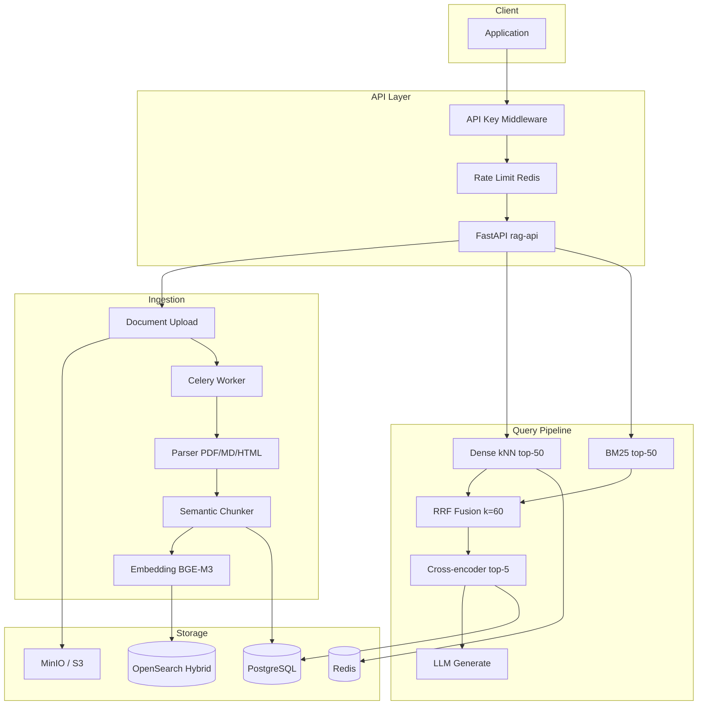

# RAG 아키텍처 상세

> [RAG 기획서](./RAG_PLANNING.md)의 아키텍처 보충 문서

## 컴포넌트 다이어그램



## 데이터 흐름

### 인덱싱

1. Client → `POST /v1/documents` (multipart file)
2. API → S3 upload + PostgreSQL document record (status: pending)
3. API → Celery `ingest_document` task enqueue
4. Worker → parse → chunk → embed (BGE-M3) → bulk index OpenSearch
5. Worker → PostgreSQL status: completed, chunk_count 갱신

### 질의

1. Client → `POST /v1/query` (query text)
2. API → query embedding (Redis cache check)
3. Parallel: OpenSearch kNN + BM25
4. RRF fuse → Cross-encoder rerank top-5
5. Build context (4096 token budget) → LLM generate
6. Response: answer + citations[] + latency_ms

## OpenSearch Index Mapping

```json
{
  "content": "text (Nori analyzer)",
  "content.english": "text (english analyzer)",
  "content.standard": "text (standard analyzer)",
  "embedding": "knn_vector (1024, HNSW, cosinesimil)",
  "chunk_id": "keyword",
  "doc_id": "keyword",
  "tenant_id": "keyword"
}
```

Index alias `rag-chunks` → physical index `rag-chunks-v1` (reindex 시 v2 swap).

## 디렉터리 구조

```
src/rag/
├── api/              # FastAPI app, routes, middleware
│   ├── main.py       # lifespan, health/ready/metrics
│   ├── routes.py     # /v1/* endpoints
│   └── middleware.py # API key, rate limit
├── ingestion/
│   ├── parsers.py    # PDF, MD, HTML, TXT
│   ├── chunker.py    # SemanticChunker
│   └── pipeline.py   # IngestionPipeline
├── retrieval/
│   ├── embeddings.py # BGE-M3, reranker, cache
│   ├── fusion.py     # RRF
│   └── pipeline.py   # RetrievalPipeline
├── generation/
│   ├── llm.py        # OpenAI-compatible client
│   └── service.py    # QueryService
├── indexing/
│   └── opensearch_client.py
├── workers/
│   └── celery_app.py
├── db/
│   ├── models.py     # Document, Chunk, IngestJob
│   └── session.py
├── storage/
│   └── s3.py
├── observability/
│   ├── logging.py
│   ├── metrics.py
│   └── tracing.py
└── config.py
```

## 확장 포인트

| 확장 | 방법 |
|------|------|
| 새 문서 포맷 | `ingestion/parsers.py`에 Parser 추가 |
| 새 embedding 모델 | `EMBEDDING_MODEL` env + index dimension 변경 |
| LLM provider 교체 | `LLM_BASE_URL` + `LLM_API_KEY` |
| Tenant 격리 | `tenant_id` filter (현재) → index-per-tenant (Phase 2) |
| Dense 전용 스토어 | Qdrant 분리 + RRF 유지 (Phase 3) |
| 검색 백엔드 교체 | `SearchBackend` 구현 + `factory.py` 등록 |

## SearchBackend 플러그인 (Dual Backend)

```
SearchBackend (Protocol) — indexing/base.py
├── OpenSearchBackend   — indexing/opensearch_client.py  (BM25+Nori, kNN)
└── PgVectorBackend     — indexing/pgvector_backend.py (FTS+Kiwi, pgvector)

Morphology: indexing/morphology.py (Kiwi, pgvector sparse용)
Factory:    indexing/factory.py → get_search_backend(name)
```

전환: `SEARCH_BACKEND=opensearch|pgvector`, API `"backend"` 필드.  
상세: [SEARCH_BACKENDS.md](SEARCH_BACKENDS.md)
