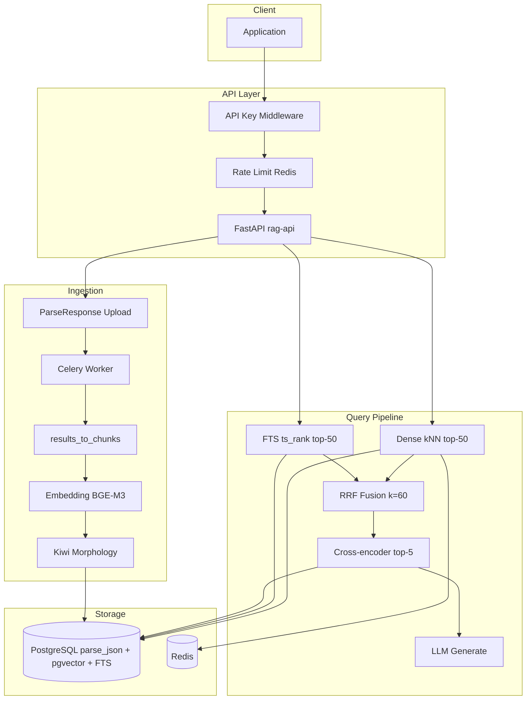
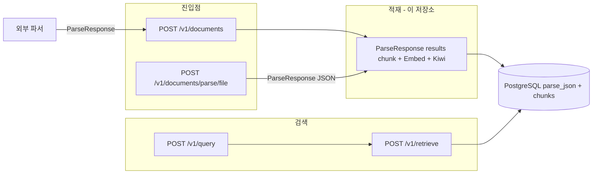

# RAG 아키텍처 상세

> [RAG 기획서](./RAG_PLANNING.md) · [그룹](./GROUP_PLANNING.md) · [청킹](./CHUNKING.md) · [parent-child 청킹](./PARENT_CHILD_PLANNING.md) · [DocuOps 전략 참고](./DOCUOPS_RAG_STRATEGY.md) · [ADR](./adr/)

## 컴포넌트 다이어그램



## 데이터 흐름

### 인덱싱

1. Client → `POST /v1/documents` (multipart file + **필수** `group_id`)
2. API → Parser Service → `documents.parse_json` 저장 (status: pending)
3. API → Celery `ingest_document` task enqueue
4. Worker → `results[]` → [`CHUNKING.md`](CHUNKING.md) 규칙으로 청크 (표는 원본+`table_row`)
5. Worker → 전 청크 INSERT (`parent_chunk_id` 포함); **searchable**만 embed (BGE-M3) + Kiwi → `embedding`/`content_morph`/`tsv`
6. Worker → PostgreSQL status: completed, chunk_count 갱신

### 질의

1. Client → `POST /v1/query` (query text)
2. API → query embedding (Redis cache check)
3. Parallel: pgvector kNN + FTS (`ts_rank` on `tsv`, Kiwi morph query)
4. RRF fuse → Cross-encoder rerank top-5
5. `table_row` hit → `parent_chunk_id`로 부모 표 content expand · 부모 dedupe
6. Build context (청크 전문, tiktoken 4096 예산, 마지막만 자름) → LLM generate
7. Response: answer + citations[] + latency_ms (`backend: "pgvector"`)

## PostgreSQL `chunks` 스키마

```sql
-- 확장
CREATE EXTENSION IF NOT EXISTS vector;

-- chunks (검색 관련 컬럼)
ALTER TABLE chunks ADD COLUMN content_morph text;
ALTER TABLE chunks ADD COLUMN tsv tsvector;
ALTER TABLE chunks ADD COLUMN embedding vector(1024);

-- 인덱스
CREATE INDEX idx_chunks_embedding_hnsw
  ON chunks USING hnsw (embedding vector_cosine_ops);

CREATE INDEX idx_chunks_tsv_gin
  ON chunks USING GIN (tsv);

-- 인덱싱 시 갱신
UPDATE chunks SET
  content_morph = :morph_text,
  embedding     = :embedding_vec,
  tsv           = to_tsvector('simple', :morph_text)
WHERE id = :chunk_id;
```

| 컬럼 | 타입 | 용도 |
|------|------|------|
| `group_id` | varchar(128) | 소속 그룹 복제 (정확 일치 필터) |
| `content` | text | 원문 (LLM 컨텍스트 전문, API snippet은 미리보기) |
| `content_morph` | text | Kiwi 형태소 분석 결과 |
| `embedding` | vector(1024) | Dense kNN (cosine, HNSW) |
| `type` | varchar(64) | ResultItem type (`table_row` 등) |
| `bbox` | jsonb | prov[0].bbox |
| `parent_chunk_id` | uuid FK → chunks.id | `table_row` → 부모 표 (nullable) |
| `tsv` | tsvector | Sparse FTS (`plainto_tsquery('simple', …)`) |

삭제 시 soft-delete: `embedding`, `content_morph`, `tsv`를 NULL로 초기화.

## 디렉터리 구조

```
src/rag/
├── api/              # FastAPI app, routes, middleware
│   ├── main.py       # lifespan, health/ready/metrics
│   ├── routes.py     # /v1/documents, retrieve, query
│   ├── groups.py     # /v1/groups CRUD
│   └── middleware.py # API key, rate limit
├── groups/
│   ├── filter.py     # retrieve SQL 필터
│   └── service.py    # CRUD, 삭제 정책
├── ingestion/
│   ├── chunker.py         # TextChunk
│   ├── parse_items.py     # ParseResponse.results → TextChunk
│   ├── table_markdown.py  # HTML table → pipe MD
│   ├── parser_client.py
│   └── pipeline.py        # IngestionPipeline (parse_json)
├── retrieval/
│   ├── embeddings.py   # BGE-M3, reranker, cache
│   ├── fusion.py       # RRF
│   ├── table_expand.py # table_row → parent table context
│   └── pipeline.py     # RetrievalPipeline
├── generation/
│   ├── llm.py        # OpenAI-compatible client
│   └── service.py    # QueryService
├── indexing/
│   ├── pgvector_backend.py  # kNN + FTS
│   ├── morphology.py        # Kiwi analyzer
│   └── factory.py
├── workers/
│   └── celery_app.py
├── db/
│   ├── models.py     # Group, Document, Chunk, IngestJob
│   └── session.py
├── observability/
│   ├── logging.py
│   ├── metrics.py
│   └── tracing.py
└── config.py
```

## 파싱 경계 · 적재는 이 저장소

원본 파싱만 외부로 둘 수 있다. chunk/embed/PG 적재와 retrieve는 여기 남는다 (ADR-0008).



- 이 저장소는 PDF/Office 파싱 없음. Parser Service 또는 parse JSON만 수신
- 검색: `chunks` JOIN `documents` (`filename`, `page`, `group_id`)

계약: [PARSE_BOUNDARY.md](PARSE_BOUNDARY.md)

## 확장 포인트

| 확장 | 방법 |
|------|------|
| 새 문서 포맷 | 외부에서 Markdown으로 변환 후 업로드 |
| 새 embedding 모델 | `EMBEDDING_MODEL` env + `vector(N)` dimension 변경 |
| LLM provider 교체 | `LLM_BASE_URL` + `LLM_API_KEY` |
| Tenant 격리 | `group_id` 정확 일치 (현재) → schema-per-tenant (Phase 2) |
| Dense 전용 스토어 | Qdrant 분리 + RRF 유지 (Phase 3) |
