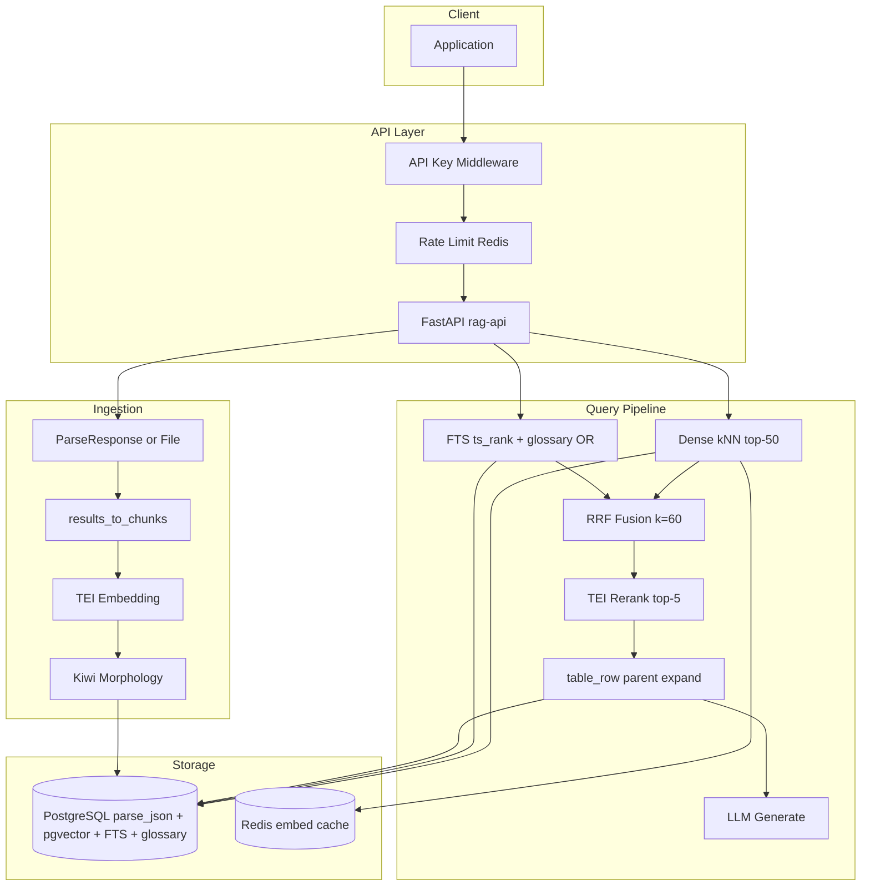
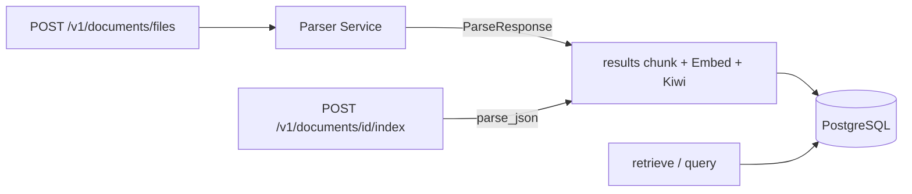

# RAG 아키텍처 상세

> [RAG 기획서](./RAG_PLANNING.md) · [그룹](./GROUP_PLANNING.md) · [청킹](./CHUNKING.md) · [Kiwi·용어집 FTS](./KIWI.md) · [파싱 경계](./PARSE_BOUNDARY.md) · [DocuOps 전략 참고](./DOCUOPS_RAG_STRATEGY.md) · [ADR](./adr/)

실행 규칙의 소스는 이 문서·`CHUNKING.md`·`KIWI.md`·코드다. `PARENT_CHILD_PLANNING.md`는 폐기 초안이다.

## 컴포넌트 다이어그램



## 데이터 흐름

### 인덱싱

1. Client → `POST /v1/documents/{id}/index` (`parse_json`) 또는 `POST /v1/documents/files` (원본 + **필수** `group_id`)
2. (파일 경로) API → Parser Service → `documents` 행 생성(`parse_json`)
3. 같은 요청(또는 `/index` 재호출)에서 동기 indexing: `results[]` → [`CHUNKING.md`](CHUNKING.md)
4. 전 청크 INSERT; **searchable**만 TEI embed + Kiwi → `embedding` / `content_morph` / `tsv`
5. status completed, `chunk_count` 갱신

문서 원문은 **S3 없음** — `parse_json` JSONB만.

### 질의

1. `POST /v1/query` 또는 `/v1/retrieve`
2. Dense: 원문 쿼리 → BGE-M3 (Redis embedding cache)
3. Sparse: 원문 longest-match 용어집 OR 확장 → Kiwi → `to_tsquery` + `ts_rank` (`fts_search`)
4. RRF → rerank top-5
5. `table_row` → `parent_chunk_id`로 부모 표 expand · 부모 dedupe
6. LLM 컨텍스트: 청크 전문 (tiktoken 4096).  
   `include_glossary_definitions=true`면 매칭 용어 definition을 `[Glossary]`로 앞에 붙임 (**default false**)
7. answer + citations + `latency_ms` (`backend: "pgvector"`)

## PostgreSQL

### `chunks` (검색)

| 컬럼 | 타입 | 용도 |
|------|------|------|
| `group_id` | varchar(128) | 그룹 정확 일치 필터 |
| `content` | text | LLM 컨텍스트 전문 |
| `content_morph` | text | Kiwi 형태소 |
| `embedding` | vector(1024) | Dense kNN (HNSW cosine) |
| `type` | varchar(64) | `table_row` 등 |
| `bbox` | jsonb | prov bbox |
| `parent_chunk_id` | uuid FK → chunks.id | 표 행 → 부모 |
| `tsv` | tsvector | Sparse FTS (`to_tsquery('simple', …)`) |

searchable=false(원본 표)는 embedding/`tsv` NULL. soft-delete 시 embedding/`content_morph`/`tsv` NULL.

### `glossary_terms` (전역 용어집)

| 컬럼 | 용도 |
|------|------|
| `id` / `standard_term` / `synonyms[]` | Sparse OR 확장 surface |
| `definition` | optional LLM 힌트 (`include_glossary_definitions`) |
| `enabled` | store 로드 필터 |

상세: [`KIWI.md`](KIWI.md). 시드: `scripts/seed_glossary.py`.

## 디렉터리 구조

```
src/rag/
├── api/           # routes, groups, glossary, middleware
├── glossary/      # store, expand, csv_io, service
├── groups/        # 평면 group_id 필터·CRUD
├── ingestion/     # parse_items, table_markdown, pipeline, TextChunk
├── retrieval/     # hybrid pipeline, table_expand, embeddings (TEI)
├── generation/    # LLM + QueryService
├── indexing/      # pgvector_backend (knn/fts_search), morphology
├── db/            # models (Group, Document, Chunk, GlossaryTerm, …)
└── observability/
```

## 파싱 경계



계약: [`PARSE_BOUNDARY.md`](PARSE_BOUNDARY.md)

## 확장 포인트

| 확장 | 방법 |
|------|------|
| 새 문서 포맷 | Parser Service 또는 parse JSON |
| embedding / rerank | TEI (`TEI_EMBEDDING_URL`, `TEI_RERANKER_URL`); URL 비우면 in-process ST |
| embedding 모델 | `EMBEDDING_MODEL` + vector dim |
| LLM | `LLM_BASE_URL` + `LLM_API_KEY` |
| 용어집 | `/v1/glossary` 또는 CSV 시드 |
| 검색 범위 | `group_id` 정확 일치 |
