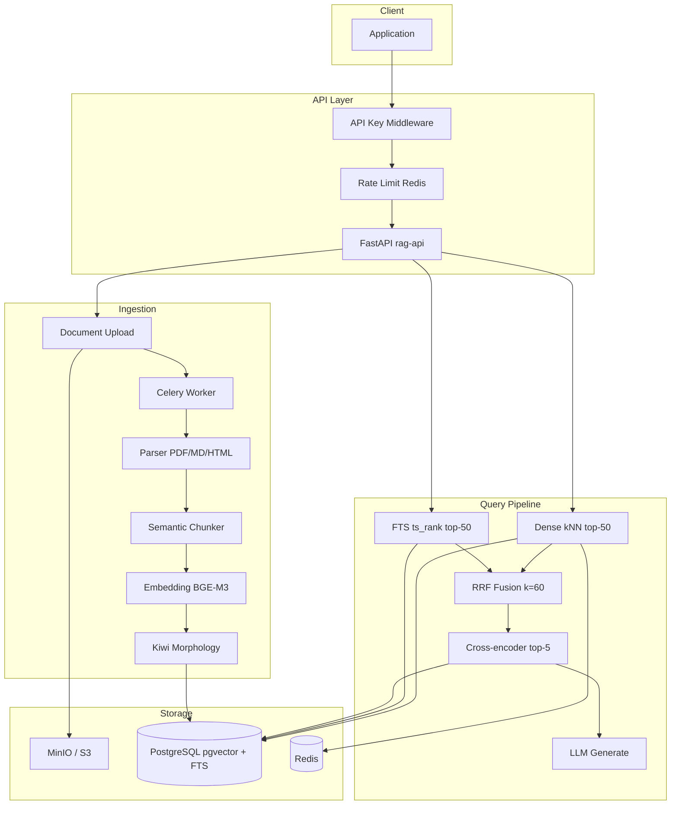

# RAG 아키텍처 상세

> [RAG 기획서](./RAG_PLANNING.md)의 아키텍처 보충 문서

## 컴포넌트 다이어그램



## 데이터 흐름

### 인덱싱

1. Client → `POST /v1/documents` (multipart file)
2. API → S3 upload + PostgreSQL document record (status: pending)
3. API → Celery `ingest_document` task enqueue
4. Worker → parse → chunk → embed (BGE-M3) → Kiwi morph
5. Worker → `chunks` 행에 `embedding`, `content_morph`, `tsv` 갱신
6. Worker → PostgreSQL status: completed, chunk_count 갱신

### 질의

1. Client → `POST /v1/query` (query text)
2. API → query embedding (Redis cache check)
3. Parallel: pgvector kNN + FTS (`ts_rank` on `tsv`, Kiwi morph query)
4. RRF fuse → Cross-encoder rerank top-5
5. Build context (4096 token budget) → LLM generate
6. Response: answer + citations[] + latency_ms (`backend: "pgvector"`)

## PostgreSQL `chunks` 스키마

```sql
-- 확장
CREATE EXTENSION IF NOT EXISTS vector;

-- chunks (검색 관련 컬럼)
ALTER TABLE chunks ADD COLUMN content_morph text;
ALTER TABLE chunks ADD COLUMN tsv tsvector;
ALTER TABLE chunks ADD COLUMN embedding vector(1024);

-- 인덱스
CREATE INDEX idx_chunks_embedding_hnsw
  ON chunks USING hnsw (embedding vector_cosine_ops);

CREATE INDEX idx_chunks_tsv_gin
  ON chunks USING GIN (tsv);

-- 인덱싱 시 갱신
UPDATE chunks SET
  content_morph = :morph_text,
  embedding     = :embedding_vec,
  tsv           = to_tsvector('simple', :morph_text)
WHERE id = :chunk_id;
```

| 컬럼 | 타입 | 용도 |
|------|------|------|
| `content` | text | 원문 (citation snippet) |
| `content_morph` | text | Kiwi 형태소 분석 결과 |
| `embedding` | vector(1024) | Dense kNN (cosine, HNSW) |
| `tsv` | tsvector | Sparse FTS (`plainto_tsquery('simple', …)`) |

삭제 시 soft-delete: `embedding`, `content_morph`, `tsv`를 NULL로 초기화.

## 디렉터리 구조

```
src/rag/
├── api/              # FastAPI app, routes, middleware
│   ├── main.py       # lifespan, health/ready/metrics
│   ├── routes.py     # /v1/* endpoints
│   └── middleware.py # API key, rate limit
├── ingestion/
│   ├── parsers.py    # PDF, MD, HTML, TXT
│   ├── chunker.py    # SemanticChunker
│   └── pipeline.py   # IngestionPipeline
├── retrieval/
│   ├── embeddings.py # BGE-M3, reranker, cache
│   ├── fusion.py     # RRF
│   └── pipeline.py   # RetrievalPipeline
├── generation/
│   ├── llm.py        # OpenAI-compatible client
│   └── service.py    # QueryService
├── indexing/
│   ├── pgvector_backend.py  # kNN + FTS
│   ├── morphology.py        # Kiwi analyzer
│   └── factory.py
├── workers/
│   └── celery_app.py
├── db/
│   ├── models.py     # Document, Chunk, IngestJob
│   └── session.py
├── storage/
│   └── s3.py
├── observability/
│   ├── logging.py
│   ├── metrics.py
│   └── tracing.py
└── config.py
```

## 확장 포인트

| 확장 | 방법 |
|------|------|
| 새 문서 포맷 | `ingestion/parsers.py`에 Parser 추가 |
| 새 embedding 모델 | `EMBEDDING_MODEL` env + `vector(N)` dimension 변경 |
| LLM provider 교체 | `LLM_BASE_URL` + `LLM_API_KEY` |
| Tenant 격리 | `tenant_id` filter (현재) → schema-per-tenant (Phase 2) |
| Dense 전용 스토어 | Qdrant 분리 + RRF 유지 (Phase 3) |
