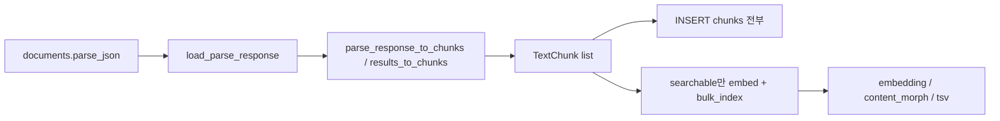

# 청킹 전략

> **목적:** `documents.parse_json`(`ParseResponse.results`) → DB `chunks` + (검색 가능한 것만) embedding/FTS.  
> **구현:** [`parse_items.py`](../src/rag/ingestion/parse_items.py) · [`table_markdown.py`](../src/rag/ingestion/table_markdown.py) · [`pipeline.py`](../src/rag/ingestion/pipeline.py)  
> **검색 시 표 복원:** [`table_expand.py`](../src/rag/retrieval/table_expand.py)  
> **설정:** [`configs/default.yaml`](../configs/default.yaml) `chunking.max_tokens` (기본 **768**)

관련: [`PARSE_BOUNDARY.md`](PARSE_BOUNDARY.md) · [`ARCHITECTURE.md`](ARCHITECTURE.md) · [`KIWI.md`](KIWI.md) · DocuOps 대비 [`DOCUOPS_RAG_STRATEGY.md`](DOCUOPS_RAG_STRATEGY.md)

---

## 0. 한 줄 요약

Markdown 전체 재분할 없음. Parser가 준 **레이아웃 item 1개 ≈ 청크 1개**(제목은 prefix, 표는 원본+행).  
표만 DocuOps식 **row-split**: 원본은 DB만, 검색은 `table_row`, 질의 후 `parent_chunk_id`로 부모 표 content expand.

---

## 1. 입력 · 파이프라인



1. Worker가 `parse_json` → `ParseResponse` 로드
2. `parse_response_to_chunks(..., max_tokens)` → `TextChunk[]`  
   - 필드: `content`, `chunk_index`, `page`, `token_count`, `type`, `bbox`, `searchable`, `parent_chunk_index`
3. 기존 `chunks` 삭제 후 **전 청크 INSERT** (`searchable=false` 포함)
4. `parent_chunk_index` → UUID `chunks.parent_chunk_id` (부모를 먼저 id 할당하는 순서로 해석)
5. `searchable=true`만 BGE-M3 embed + Kiwi morph → `embedding` / `content_morph` / `tsv` 갱신  
   - `searchable=false`(row-split된 원본 표)는 embedding·FTS **NULL**, content만 보관

토큰: tiktoken `cl100k_base`. item·청크 간 **overlap 없음**.

---

## 2. item → 청크 규칙 (`results_to_chunks`)

| 규칙 | 코드 동작 |
|------|-----------|
| 스킵 | `type ∈ {number, header, footer}` 또는 빈 `markdown` |
| 제목 보류 | `doc_title` / `paragraph_title` / `section_header` → **단독 청크 없음**, `pending_heading`으로 다음 본문·**원본 표**에 `제목\n\n본문` prefix |
| 본문 | 그 외 item → 1청크(+ `max_tokens` 초과 시 분할). `type`/`page`/`bbox` 유지 |
| page | `prov[0].page_no` |
| bbox | `prov[0].bbox` → JSONB |
| 표 판별 | `type ∈ {table, table_text}` **또는** 파이프 MD(`\|…\|`) **또는** `<table` 포함 |
| 초과 분할 | `_split_oversized`: 문장 → 단어. 분할편도 동일 `type`/`bbox`/`page`/`searchable`/`parent_chunk_index` |

본문 예: `text`, `table`, `table_row`(생성), `header_image`, `vision_footnote` 등 (Parser `ResultItem.type` 그대로, 표 위장 시 `table`로 정규화).

---

## 3. 표: 정규화 → 원본 + row-split

### 3.1 HTML → Markdown

`prepare_table_content` ([`table_markdown.py`](../src/rag/ingestion/table_markdown.py)):

- `<tr>`/`<td>`/`<th>`가 있으면 → GFM 파이프 표 (`rowspan`/`colspan` 격자 전개, 중첩 table 스킵)
- 이미 파이프 MD면 그대로

### 3.2 청크 생성 (`_is_table_item` 분기)

| 단계 | 동작 |
|------|------|
| 원본 | heading prefix + 정규화 본문 → **부모** `TextChunk`. `type`은 `table`/`table_text` 유지, 아니면 `"table"` |
| row-split 조건 | `_split_table_rows`: 데이터 행 **≥ 2**일 때만 행 목록 반환 |
| 파이프 MD | 헤더줄 + 구분선(`\|---\|`) 제외한 데이터행 → 각 `헤더\n데이터행` |
| HTML fallback | 아직 `<tr>`면 셀 텍스트로 행 조립(정규화 실패 대비) |
| 검색 플래그 | 행이 생기면 원본 `searchable=false`, 각 행 `searchable=true` · `type=table_row` · `parent_chunk_index=부모 chunk_index` |
| 행 1개 이하 | split 없음 → 원본만, `searchable=true` |
| page/bbox | 행 = 부모와 동일 |

DB에는 `parent_chunk_id` FK(`chunks.id` → `chunks.id`, CASCADE). 청킹 단계의 `parent_chunk_index`는 ingest 중 UUID 매핑용 임시 링크.

```text
예) 데이터 행 3개 표
  chunk_index 0  type=table      searchable=false  content=전체 표(+제목)   parent=null
  chunk_index 1  type=table_row  searchable=true   content=헤더\n행1      parent→0
  chunk_index 2  type=table_row  searchable=true   content=헤더\n행2      parent→0
  chunk_index 3  type=table_row  searchable=true   content=헤더\n행3      parent→0
```

---

## 4. 검색 · 컨텍스트 (청킹과 짝)

Retrieve 순서 ([`retrieval/pipeline.py`](../src/rag/retrieval/pipeline.py)):

1. dense kNN + FTS (원본 표는 인덱스 없어 hit 안 됨)
2. RRF → rerank
3. **`expand_hits_with_parent_tables`**
   - `table_row` hit → `parent_chunk_id`로 부모 `content` 교체, `type=table`
   - 같은 부모는 **한 번만**(최고 score 행 기준 유지)
   - FK 없는 레거시 행 → 같은 `doc_id`에서 `chunk_index` 앞쪽 최근 `table`/`table_text` id fallback

재 ingest 후에야 신규 FK·searchable 정책이 반영된다. (마이그레이션만으로는 기존 행에 `parent_chunk_id`가 안 채워짐)

---

## 5. 파라미터

| 키 | 기본 | 역할 |
|----|------|------|
| `chunking.max_tokens` | 768 | 단일 청크(원본/행/본문) 상한; 초과 시만 문장·단어 분할 |

---

## 6. 코드 맵

| 파일 | 역할 |
|------|------|
| `ingestion/parse_items.py` | item 규칙, 표 split, `TextChunk` 생성 |
| `ingestion/table_markdown.py` | HTML → 파이프 MD |
| `ingestion/chunker.py` | `TextChunk` dataclass |
| `ingestion/pipeline.py` | parse → DB + searchable embed, `parent_chunk_id` 매핑 |
| `db/models.py` / alembic `011` | `chunks.parent_chunk_id` |
| `retrieval/table_expand.py` | row hit → 부모 표 expand · dedupe |
| `indexing/pgvector_backend.py` | hit에 `parent_chunk_id` 포함 |
