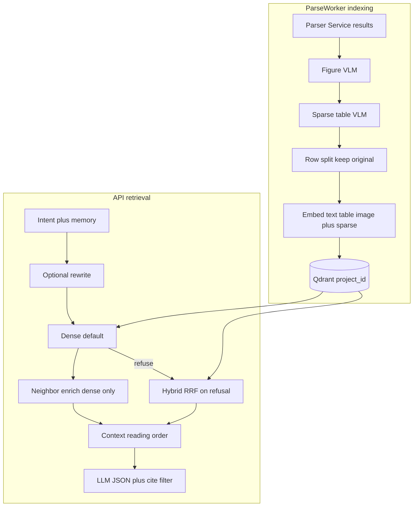

# DocuOps ML API — 청킹 · 리트리브 전략 참고

> **목적:** 이 저장소(`rag`)와 품질·설계를 맞출 때 쓰는 **DocuOps ML API** 쪽 인덱싱/검색 전략 요약.  
> **원본 코드:** `docuops_ml_api` — `services/parse-worker/src/worker.py`, `services/api/src/rag/`  
> **작성일:** 2026-09-03  
> **성격:** 참고 문서 (이 저장소 구현 스펙이 아님)

관련: [`CHUNKING.md`](CHUNKING.md) · [`PARSE_BOUNDARY.md`](PARSE_BOUNDARY.md) · [`PARENT_CHILD_PLANNING.md`](PARENT_CHILD_PLANNING.md) · [`ARCHITECTURE.md`](ARCHITECTURE.md)

---

## 0. 한 줄 요약

| 영역 | DocuOps |
|------|---------|
| 청킹 | 고정 토큰 청크 아님. **OCR layout bloc** + (표) **행 단위 sub-bloc** |
| 표 보강 | OCR 빈 표 → **VLM 전사**, 이후 row-split |
| 임베딩 | Qwen-VL계 **4096-dim**, `/embed/text` · `/embed/table` · `/embed/image` + local sparse |
| 기본 검색 | **dense** + score threshold → (옵션) LLM rerank → neighbor → LLM |
| 실패 시 | dense 거절 답이면 **hybrid_rrf 1회 재시도** |
| 계층 | parent-child 트리 **없음** (표 원본+행 sibling만) |

이 저장소(`rag`)와의 대비는 [§5](#5-이-저장소-rag와의-대비) 참고.

---

## 1. 인덱싱 · 청킹 (`parse-worker`)

### 1.1 원자 단위

- Parser Service(`EXTERNAL_PARSER_URL`, 예: `:17000/parse`)가 돌려주는 **ResultItem 1개** = 기본 블록.
- 필드: `type` / `bloc_name`, `content`·`markdown`, `id`, `prov[]`(page, bbox, charspan).
- `_parse_results_to_bloc_data`로 정규화. **빈 content는 버림.**
- Excel은 OCR 없이 시트당 1블록 → 이후 동일 인덱싱 경로.

고정 `max_tokens` SemanticChunker / Hierarchical parent-child로 자르지 **않는다.**

### 1.2 Parse 직후 파이프라인 순서

```
OCR /parse 응답 (results[])
  → 페이지·figure crop 렌더 + S3 업로드
  → figure VLM 설명 (_describe_figures)
  → sparse table VLM 전사 (_enrich_sparse_tables)  ※ figure 이후
  → informative figure_description → content 치환
  → bbox를 프론트 오버레이용 좌표로 변환
  → bloc 정규화
  → checkbox VLM 보정 (_correct_checkbox_states)
  → _rag_add_sync (row-split → embed → Qdrant)
```

외부 `/parse` 호출 자체는 거의 서버 기본값이다. env가 true면 `table_merge` / `nested_detection` 쿼리만 추가한다.  
`output_format=markdown`은 쓰지 않고 **json `results[]`** 를 쓴다.

### 1.3 Sparse table VLM

- 함수: `_enrich_sparse_tables` → `_call_vlm_for_table`
- **언제:** `type=table` 인데 본문 문자가 거의 없음 (`SPARSE_TABLE_THRESHOLD` 등), 또는 figure인데 설명이 “표”인 경우
- **어떻게:** bbox crop 이미지 → `FIGURE_VLM_URL` + `TABLE_TRANSCRIPTION_PROMPT` → HTML/텍스트로 content 보강
- **토글:** `SPARSE_TABLE_ENRICHMENT` (`auto` / `true` / `false`). `auto`는 후보 수가 `SPARSE_TABLE_MAX_CANDIDATES` 초과면 스킵
- 관련: `SPARSE_TABLE_*`, `FIGURE_VLM_*`, `ENRICH_RENDER_SCALE`, `ENRICH_CLIP_PAD_PT`

### 1.4 표 행 분할 (`_split_table_rows`)

| 항목 | 내용 |
|------|------|
| 시점 | `_rag_add_sync` 초반, modality=`table`인 블록마다 |
| 조건 | 데이터 행 ≥ 2. 아니면 분할 안 함 |
| 포맷 | 파이프 Markdown 또는 HTML `<tr>` → content = `헤더행\n데이터행` |
| 이름 | `{parent_bloc}__row{i}` |
| 메타 | `header_content`, `row_content` (생성 시 헤더 1회 표시용) |
| 원본 | **유지.** 원본 표 bloc + 행 sub-bloc **둘 다** 임베딩 |

목적: 큰 표 하나를 임베딩하면 centroid가 되어 개별 셀/행 질의가 약해지는 **embedding dilution** 완화.

### 1.5 Modality → 임베딩 엔드포인트

| modality | 판정 | 엔드포인트 | 입력 요약 |
|----------|------|------------|-----------|
| table | 이름에 table, 파이프표, CSV성 | `/embed/table` | HTML→MD 후 content 갱신 |
| image | data-URI / 이미지 URL 등 | `/embed/image` | 실패 시 text fallback |
| text | 그 외 | `/embed/text` | `"Page {n} - {bloc_name}: {content}"` |

- Dense dim: **`RAG_COLLECTION_VECTOR_SIZE`** (운영 예: **4096**)
- 모든 point에 **local sparse**(토큰 TF·해시)도 함께 저장 (hybrid용)

### 1.6 Qdrant 저장

- Collection 이름 = `project_id`
- Point ID = `md5("{project_id}:{document_id}:{bloc_name}:{bloc_order}")`
- payload 예: `document_id`, `bloc_name`, `bloc_type`, `bloc_order`, `page_number`, `content`, `bbox`, `charspan`, `document_type`, (행이면) `header_content` / `row_content`
- 재인덱싱 시 해당 `document_id` point 삭제 후 upsert
- 문서 타입 LLM 분류(`_classify_document_type`) → 전 point에 `document_type` (실패 시 `general`)

### 1.7 하지 않는 것 (인덱싱)

- 헤딩/토큰 가방 SemanticChunker
- parent-child / AutoMerging 계층 벡터
- 페이지 header/footer/페이지번호 bloc 일괄 drop (특별한 필터 없음)
- chunk JSON·embedding을 클라이언트가 직접 넣는 경로 (워커가 소유)

---

## 2. 리트리브 · 생성 (`api/src/rag`)

### 2.1 진입 흐름

```
POST /rag/query (등)
  → intent 분류 (retrieval / summarization / conversational / draft / similarity / non_relevant)
  → memory 세션 (있으면)
  → (history 있을 때) query rewrite — 검색용만, UI 비노출
  → embed(search_query)
  → retrieve (fusion_method)
  → context 조립 → LLM JSON 답 + references
  → citation 필터 → memory 저장(거절 제외)
```

| 모듈 | 역할 |
|------|------|
| `router.py` | intent, active_docs, scope_hint |
| `classifier.py` | LLM intent |
| `query_rewriter.py` | 대화 문맥 반영 재작성 |
| `service.py` | retrieve + generate |
| `fusion.py` | RRF / early fusion + query-type α |
| `context.py` | truncate |

### 2.2 검색 모드 (`fusion_method`)

요청 기본값: **`dense`**

| 모드 | 동작 |
|------|------|
| **dense** | Qdrant cosine (+ `RAG_SCORE_THRESHOLD`) → (옵션) LLM rerank → scope boost → **neighbor enrich** → context |
| **hybrid_rrf** | dense + sparse → 가중 RRF. `(1-α)/(k+rank_s) + α/(k+rank_d)` |
| **hybrid_early** | min-max 후 `α·dense + (1-α)·sparse`, 양쪽 hit면 ×1.1 |

- 다문서: 문서별 fanout 슬롯
- hybrid 경로에서는 **neighbor enrichment 없음**
- sparse 질의 문자열은 원문 `request.query`, dense emb는 rewrite 후 `search_query`일 수 있음 (비대칭)

### 2.3 Adaptive α (`fusion.py`)

질의 유형별 dense 비중(α↑ = dense↑) 예:

| QueryType | α (대략) |
|-----------|----------|
| keyword / numerical | 0.3 ~ 0.35 |
| technical / extractive | ~0.4 |
| boolean / general | ~0.5 |
| compare / enumerative / multi_hop | 0.55 ~ 0.6 |
| semantic | ~0.7 |

**Sparse yield damping:** dense top 키가 sparse에 얼마나 덮이는지 보고, 덮임이 약하면 α를 dense 쪽으로 더 밈 (`RAG_SPARSE_YIELD_DAMPING`).

### 2.4 Rerank

- `RAG_ENABLE_RERANK` (기본 true)일 때 dense 후보에 **LLM 재랭킹**
- 후보 pool: `RAG_RERANK_POOL_SIZE` (예: 50), 스니펫 앞 `RAG_RERANK_SNIPPET_CHARS` 자
- LLM이 “직접 관련” 인덱스 리스트를 고르면 앞으로 재배치; 실패 시 원순서

### 2.5 Neighbor enrichment (`_enrich_with_neighbors`) — dense만

| 트리거 | `bloc_order` 윈도우 |
|--------|---------------------|
| 짧은 라벨 (`:` / `：`로 끝, 길이 짧음) | order−1 … order+2 |
| 헤딩/타이틀류 | order−1 … order+5 (헤딩 최대 5) |

같은 `document_id`에서 scroll해 없는 `bloc_name`만 append. 이웃 score는 0으로 취급될 수 있음.

### 2.6 Scope · 문서 필터

| 신호 | 동작 |
|------|------|
| `scope_hint` (직전 턴 bloc) | 매칭 chunk score × `(1 + RAG_SCOPE_HINT_BOOST)` — **soft**, 필터 아님 |
| session `active_docs` 1개 | hard `document_ids` |
| 질의에 문서명 명시 | named-doc → filter + context에 매핑 안내 |

### 2.7 Refusal → hybrid 재시도

1. `fusion_method=dense`로 생성
2. 답이 “문서에서 확인 안 됨”류(`_is_refusal`)이면 **`hybrid_rrf`로 `query()` 1회 재귀**
3. hybrid도 refuse면 표준 거절 메시지 + refs 비움

### 2.8 컨텍스트 조립

1. 문서 간: 문서별 max retrieval score 내림차순  
2. 문서 내: `(page_number, bloc_order)` **reading order**  
3. 라벨: `[Document N, Chunk M]`  
4. **표 행 헤더 dedupe:** `header_content`+`row_content`가 있으면 parent( `__rowN` 제거 키)당 헤더는 1회만, 이후 sibling은 행만  
5. 예산: `LLM_MAX_CONTEXT_CHARS` − overhead(약 3000). greedy append, 넘치면 truncate 표시  
6. project-wide면 document manifest를 앞에 붙일 수 있음

### 2.9 Citation

- LLM JSON `references`의 `[Document N, Chunk M]`만 refs에 남김
- refusal → refs `[]`
- cite 없고 manifest도 없으면 retrieval top **최대 5개** pad
- 본문 citation 마커는 finalize 단계에서 strip/치환

---

## 3. Parse·인덱싱 관련 주요 env (staging 예)

### 외부 Parser
| 키 | 예 | 역할 |
|----|----|------|
| `EXTERNAL_PARSER_URL` | `http://…:17000/parse` | OCR/layout |
| `PARSER_TIMEOUT` | 2000 | 초 |
| `PARSER_MAX_CONCURRENT` | 6 | 동시 호출 |
| `PARSER_MAX_RETRIES` / `PARSER_RETRY_DELAY` | 2 / 3.0 | 재시도 |
| `TABLE_MERGE_ENABLED` / `NESTED_TABLE_DETECTION_ENABLED` | true | `/parse` 쿼리 플래그 (파서 빌드에 따라 무시될 수 있음) |

### 워커 후처리 · 임베딩
| 키 | 역할 |
|----|------|
| `DOC_CONVERSION_*` | Office→PDF |
| `FIGURE_VLM_*`, `FIGURE_RENDER_*` | figure/표 crop·VLM |
| `SPARSE_TABLE_*` | 빈 표 VLM |
| `CHECKBOX_TRIGGER_MIN`, `ENRICH_*` | 체크박스·crop pad |
| `EMBEDDING_SERVICE_URL`, `EMBED_*`, `RAG_COLLECTION_VECTOR_SIZE` | 임베딩 |
| `QDRANT_*` | 벡터 저장 |
| `PARSE_TASK_*`, `WORKER_*` | 태스크 한도·동시성 |
| S3 `S3_*` | 원본·페이지 이미지·메타 |

### API 오케스트레이션
`PARSE_ENQUEUE_LOCK_TTL_SECONDS`, `PARSE_NEG_CACHE_TTL_SECONDS`, `STUCK_DOC_*`, `UPLOAD_*`, `MAX_UPLOAD_SIZE_MB`

### 검색·생성 (parse와 무관하지만 품질에 직결)
| 키 | 예 | 역할 |
|----|----|------|
| `RAG_TOP_K` | 10 | 최종 chunk 수 |
| `RAG_SCORE_THRESHOLD` | 0.3 | dense cutoff (0=off) |
| `RAG_RRF_K` | 60 | RRF k |
| `RAG_ENABLE_RERANK` | true | LLM rerank |
| `RAG_RERANK_POOL_SIZE` | 50 | rerank 후보 |
| `RAG_SPARSE_YIELD_DAMPING` | 0.5 | α 보정 |
| `RAG_SCOPE_HINT_BOOST` | 0.1 | 직전 bloc soft boost |
| `LLM_MAX_CONTEXT_CHARS` | 24000 | context 예산 |
| `MAX_TOKENS_RETRIEVAL` | 2048 | 생성 |
| `MEMORY_*` | | 멀티턴 |

---

## 4. 파이프라인 다이어그램



---

## 5. 이 저장소 (`rag`)와의 대비

| | DocuOps | `rag` (2026-09 기준) |
|--|---------|---------------------|
| 단위 | OCR bloc + **표 행** | Parser `results[]` item (표 통째) |
| 표 VLM | 있음 | 없음 |
| 임베딩 | 4096 multimodal | BGE-M3 1024 |
| 기본 검색 | **dense** + threshold | 항상 **hybrid+RRF** → rerank top-5 |
| Neighbor / rewrite / intent | 있음 | 없음 |
| Context | reading order + 표 헤더 dedupe ~24k자 | rank 순, `context_max_tokens` 4096 |
| 저장소 | Qdrant | PostgreSQL pgvector + Kiwi FTS |
| Parent-child | 없음 (행 sibling만) | 기획만 / 브랜치별 |

---

## 5.1 이식 최소 세트 (MVP)

오늘 material RAGAS의 핵심 실패는 **context_precision**(잡음 top-k)과 표·구조 질의이다.  
아래 **2개만** 이식하는 것을 최소 세트로 둔다. 임베딩 교체·VLM·intent는 제외.

### 포함한다

| # | 항목 | DocuOps 원본 | `rag`에서 할 일 | 손대는 곳 |
|---|------|--------------|-----------------|-----------|
| **A** | 표 **row-split** (+ 원본 유지) | `_split_table_rows` | **구현됨** — [`parse_items.py`](../src/rag/ingestion/parse_items.py). 파이프 MD + HTML `<tr>`. 재 ingest 필요 | [`parse_items.py`](../src/rag/ingestion/parse_items.py), [`CHUNKING.md`](CHUNKING.md) |
| **B** | 검색 **dense-first** | 기본 `fusion_method=dense` | (1) `/v1/query`·기본 retrieve 모드를 **dense**로 (또는 hybrid를 옵션으로만). (2) dense **score threshold** (예: 0.3, YAML). (3) `rerank_top_n`을 **5→10** 근처로. (4) 선택: 생성 답이 거절류면 **hybrid 1회 재시도** | [`configs/default.yaml`](../configs/default.yaml), [`retrieval/pipeline.py`](../src/rag/retrieval/pipeline.py), [`generation/service.py`](../src/rag/generation/service.py), [`pgvector_backend.py`](../src/rag/indexing/pgvector_backend.py) |

재적재: **A**는 문서 재 ingest 필요. **B**는 설정·코드만으로 바로 측정 가능.

### 의도적으로 빼는 것 (MVP 밖)

| 항목 | 이유 |
|------|------|
| Sparse table **VLM** | GPU/FIGURE_VLM 의존, Parser Service 밖에 DocuOps 전용 파이프라인 |
| 임베딩 4096 / `/embed/table` | 인프라·차원·마이그레이션 큼. A/B만으로도 precision 개선 검증 가능 |
| Neighbor enrich | 이득 있으나 `bloc_order`/같은 문서 인접 전제; A 이후 2차로 |
| Query rewrite / intent / memory | 멀티턴·UX; material 단발 평가와 무관 |
| Parent-child expand | 기획서와 겹침; row-split이 표 쪽을 먼저 커버 |
| Qdrant / named sparse vector | 스택 교체. 기존 Kiwi FTS + RRF로 hybrid 재시도만 하면 됨 |

### 성공 기준 (최소)

- material-simple/complex RAGAS: **context_precision**이 게이트를 넘거나 9/3 대비 유의미 상승
- 표·행 단위 골든 질의 몇 개에서 정답 청크가 top-k에 안정적으로 등장
- 기존 hybrid 전용 벤치(kobaco 등)는 `mode=hybrid`로 회귀 가능해야 함

### 다음 라운드 (MVP 통과 후)

3. Neighbor (또는 heading–본문 co-chunk 강화)  
4. Context: page/`bloc_order` 정렬 + 표 헤더 dedupe + 예산 상향  
5. 임베딩 정렬 / table VLM (인프라 여유 시)

---

## 5.2 품질 갭을 줄일 때 전체 우선순위 (참고)

1. ~~표 row-split~~ → **MVP A**  
2. ~~dense-first + threshold~~ → **MVP B**  
3. 임베딩 서비스/차원 정렬  
4. neighbor 또는 parent expand  
5. sparse table VLM

---

## 6. 원본 위치 (docuops_ml_api)

| 경로 | 내용 |
|------|------|
| `services/parse-worker/src/worker.py` | parse 호출, VLM, `_split_table_rows`, `_rag_add_sync` |
| `services/api/src/rag/service.py` | query, dense/hybrid, neighbor, refusal retry |
| `services/api/src/rag/fusion.py` | RRF / early / adaptive α |
| `services/api/src/rag/query_rewriter.py` | rewrite |
| `services/api/src/rag/classifier.py` | intent |
| `services/api/src/rag/context.py` | truncate |
| `deploy/*/env.example` | 운영 기본 env |
