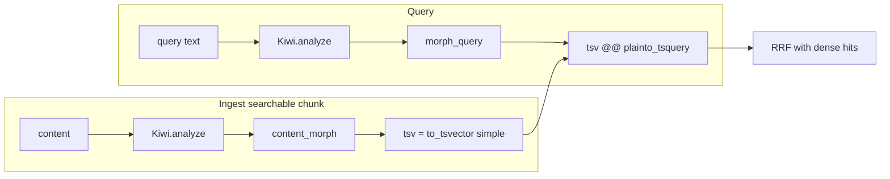

# Kiwi 형태소 · Sparse FTS

> **목적:** 한국어 Sparse 검색을 위해 문서·쿼리를 같은 방식으로 형태소 분해한다.  
> **구현:** [`src/rag/indexing/morphology.py`](../src/rag/indexing/morphology.py) · [`pgvector_backend.py`](../src/rag/indexing/pgvector_backend.py)  
> **의존:** `kiwipiepy` (`pyproject.toml`)  
> **결정:** [ADR-0001](adr/0001-postgresql-pgvector-kiwi-hybrid-search.md)

관련: [`ARCHITECTURE.md`](ARCHITECTURE.md) · [`CHUNKING.md`](CHUNKING.md)

---

## 0. 역할

Dense(BGE-M3 임베딩)와 별도로, PostgreSQL **tsvector FTS**용 텍스트를 만든다.

| 단계 | 입력 | Kiwi | 결과 |
|------|------|------|------|
| Ingest (`bulk_index`) | 청크 `content` | `analyze` | `content_morph` + `tsv = to_tsvector('simple', content_morph)` |
| Retrieve (`bm25_search`) | 사용자 질의 | `analyze` | `plainto_tsquery('simple', morph_query)`로 `tsv` 매칭 · `ts_rank` |

문서와 쿼리를 **동일 analyzer**로 맞춰야 “정보시스템” ↔ “정보 / 시스템”처럼 조사·활용이 다른 한국어가 맞는다. PG `korean` 사전 대신 **앱에서 Kiwi → `simple` config**를 쓴다 (ADR-0001).

임베딩 벡터·LLM 컨텍스트에는 Kiwi 결과를 **넣지 않는다.** Sparse 경로 전용이다.

---

## 1. Analyzer (`KiwiMorphAnalyzer`)

```python
# morphology.py (요약)
Kiwi()  # lazy load, get_morph_analyzer()는 process당 1회(@lru_cache)

def analyze(text) -> str:
    for token in kiwi.tokenize(text):
        form = token.form.strip()
        if len(form) > 1 or form.isalnum():  # 한 글자 비영숫자 형태소는 버림
            tokens.append(form)
    return " ".join(tokens) if tokens else text  # 전부 걸리면 원문 유지
```

- `token.form`만 사용 (품사 태그는 FTS에 안 씀)
- 공백으로 이어 붙인 문자열 → PG `simple`이 공백 단위로 lexeme 분할
- 빈 문자열 / 공백만이면 `""`
- 쿼리 analyze 결과가 비면 `bm25_search`가 **원문 쿼리**로 fallback

사용자 사전·도메인 사전 로딩은 **현재 없음** (`Kiwi()` 기본 사전만).

---

## 2. Ingest

[`IngestionPipeline`](../src/rag/ingestion/pipeline.py)이 searchable 청크만 `build_index_document` → `bulk_index`.

```text
content (원문)
  → morph.analyze(content) → content_morph
  → UPDATE chunks SET
        content_morph = ...,
        embedding     = ...,
        tsv           = to_tsvector('simple', content_morph)
```

- `searchable=false` 표 원본: embed/Kiwi/`tsv` 갱신 **안 함** (NULL)
- 문서 soft-delete: `embedding` / `content_morph` / `tsv` NULL

인덱스: `idx_chunks_tsv_gin` (GIN on `tsv`).

---

## 3. Retrieve (Sparse 다리)

[`RetrievalPipeline`](../src/rag/retrieval/pipeline.py): dense kNN ∥ FTS → RRF → rerank → (표 expand).

FTS SQL 요지:

```sql
WHERE c.tsv @@ plainto_tsquery('simple', :morph_query)
ORDER BY ts_rank(c.tsv, plainto_tsquery('simple', :morph_query)) DESC
LIMIT :k   -- 기본 sparse_k=50
```

- `group_id` 필터는 dense와 동일 (`group_filter_clause`)
- `tsv IS NULL` 청크는 Sparse hit 불가
- 점수 이름은 코드상 `bm25_search`이나 실제는 **`ts_rank`** (OpenSearch BM25 아님)

---

## 4. 흐름



---

## 5. 코드 맵

| 파일 | 역할 |
|------|------|
| `indexing/morphology.py` | `KiwiMorphAnalyzer.analyze`, singleton |
| `indexing/pgvector_backend.py` | `bulk_index` / `bm25_search`에서 Kiwi 호출 |
| `configs/default.yaml` | `retrieval.sparse_k` (Kiwi 설정 키 없음) |
| alembic `002_pgvector_fts` | `content_morph`, `tsv`, GIN |

---

## 6. 한계 · 운영 메모

- Worker/API 프로세스 첫 FTS·index 때 Kiwi 모델 로드 (로그 `loading_kiwi_morph_analyzer`)
- 한 글자 한글 형태소는 필터로 빠질 수 있음 → 짧은 키워드 Sparse 약화 가능
- 도메인 고유명사 미등록 시 분절 품질↓ — 필요 시 kiwipiepy 사용자 사전 확장 (미구현)
- Dense와 독립이므로 Kiwi만 바꿔도 임베딩 재계산은 불필요. **`tsv`/`content_morph` 재적재**는 필요
